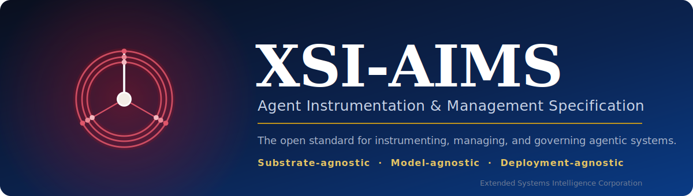
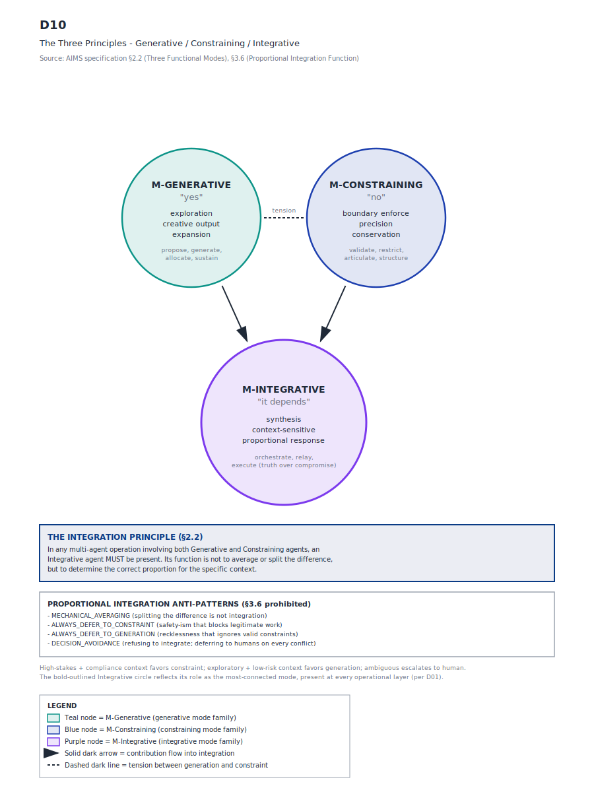
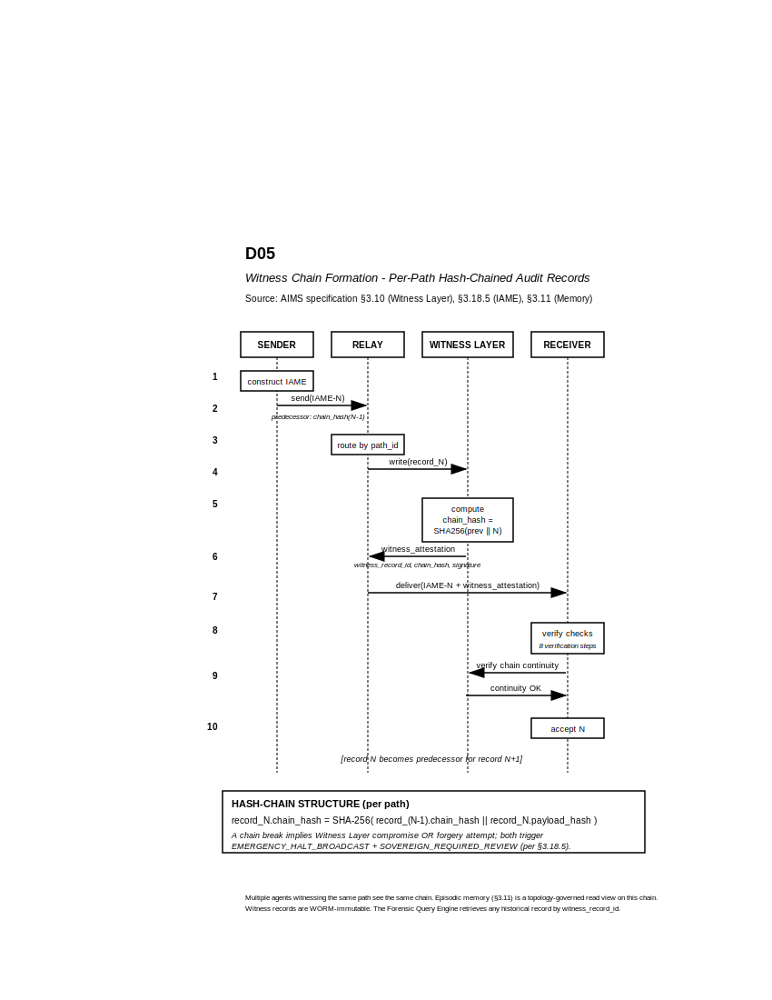
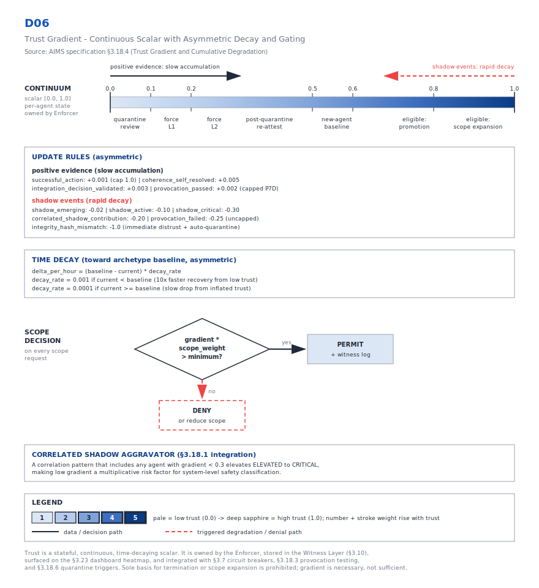
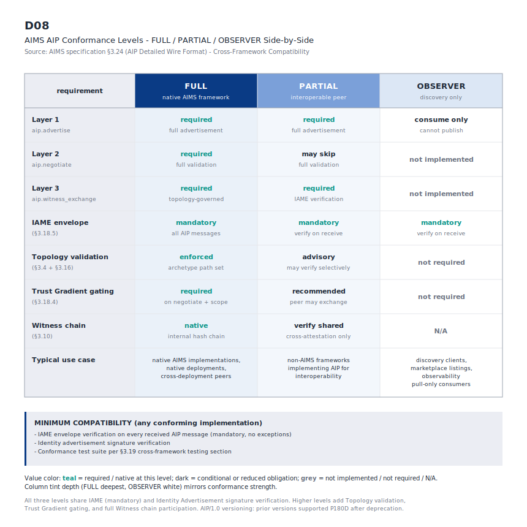

  

  
  
  
  

  <b>The open standard for instrumenting, managing, and governing agentic systems.</b> 
  <i>Substrate-agnostic &nbsp;·&nbsp; Model-agnostic &nbsp;·&nbsp; Deployment-agnostic.</i>

  <a href="https://extended-systems-intelligence.github.io/aims/">Documentation site</a> &nbsp;·&nbsp;
  <a href="spec/XSI-AIMS-specification.md">Read the Specification</a> &nbsp;·&nbsp;
  <a href="#key-concepts">Key Concepts</a> &nbsp;·&nbsp;
  <a href="#conformance">Conformance</a> &nbsp;·&nbsp;
  <a href="CONTRIBUTING.md">Contributing</a> &nbsp;·&nbsp;
  <a href="../../discussions">Discussions</a>

---

## The problem

The first generation of agentic systems was built for capability. The next has to be built for **trust** — agents that people, organizations, and other agents can supervise, audit, and reason about over time.

Today's multi-agent orchestration frameworks leave recurring gaps open:

- **Incomplete capability disclosure** — what an agent can actually do is not declared in a verifiable form.
- **Unstructured inter-agent communication** — messages between agents carry no consistent envelope, identity, or integrity guarantees.
- **Asymmetric lifecycle management** — agents are easy to create and hard to retire, audit, or bound.
- **No cross-substrate coherence** — there is no shared contract for governing agents that span different models, runtimes, and deployments.

## What is XSI-AIMS

**XSI-AIMS** is a specification for **horizontal supervisory-agent governance**: a framework for the safe deployment of agents that monitor and manage other agents on behalf of a system's principals. It describes the contracts an agentic system must meet — registration, communication, audit, lifecycle, supervision, and conformance — **without prescribing the implementing technology**.

It expresses *what* must be present and *how it must behave*, not *how it must be built*. A sovereign-cloud orchestrator, an on-premises deployment, and a regulator's reference platform can all claim conformance against the same text. The specification is implementation-neutral by construction.

## Key concepts

The specification is anchored on a few load-bearing ideas; the rest of the vocabulary supports them.

### The Three Principles

Every agent expresses three orthogonal functions — **Generative**, **Constraining**, and **Integrative**. An agent that only generates produces unconstrained output; one that only constrains produces nothing; one that integrates without the other two has nothing to synthesize. The archetype taxonomy and the safety substrate are organized around these three.

### Four layers, three modes

XSI-AIMS stacks four operational layers — `L-Intent` / `L-Plan` / `L-Form` / `L-Exec` — from organizational intent down to material action, with three functional modes (`M-Generative` / `M-Constraining` / `M-Integrative`) expressed at each.

### The ten-archetype taxonomy

Agents are typed by archetype — Sovereign, Visionary, Architect, Provider, Enforcer, Orchestrator, Sustainer, Articulator, Relay, Executor — each derived from which Principle it primarily serves.

### The Witness Layer

An immutable, hash-chained audit substrate records every action and every inter-agent message. Memory is a topology-governed view built on top of it across four layers (working, episodic, semantic, procedural) — so a conformant system never *loses* memory; it moves events out of active context, never out of existence.

  
  

### The Trust Gradient

A continuous trust scalar with cumulative degradation gates discretionary action, from `L1-Shadow` through `L5-Autonomous`.

## How to read this specification

The standard is highly technical. The detailed technical build — the function catalog — lives in machine-readable YAML; the prose and diagrams are the approachable layer that makes the standard legible.

1. **Start here** — this README, for orientation and the core concepts above.
2. **The specification** — [`spec/XSI-AIMS-specification.md`](spec/XSI-AIMS-specification.md): the full normative text (scope, terminology, management components, safety substrate, conformance).
3. **The function catalog** — [`spec/catalog/aims-function-catalog.yaml`](spec/catalog/aims-function-catalog.yaml): the detailed, machine-readable technical build referenced by the spec.
4. **The diagrams** — [`docs/figures/`](docs/figures/): the full set of explanatory diagrams.

## Diagrams

| | | |
|---|---|---|
| [Three Principles](docs/figures/D10-three-principles.svg) | [Stacked architecture](docs/figures/D01-stacked-architecture.svg) | [Ten archetypes](docs/figures/D04-ten-archetypes-taxonomy.svg) |
| [AIP wire format](docs/figures/D02-aip-wire-format-envelope.svg) | [IAME envelope](docs/figures/D03-iame-envelope.svg) | [Witness chain](docs/figures/D05-witness-chain-formation.svg) |
| [Trust gradient](docs/figures/D06-trust-gradient.svg) | [Shadow detection](docs/figures/D07-shadow-detection-flow.svg) | [Conformance levels](docs/figures/D08-aip-conformance-levels.svg) |
| [Substrate identity](docs/figures/D09-substrate-identity-multi-model.svg) | [Four-layer memory](docs/figures/D11-four-layer-memory.svg) | |

## Conformance

Implementations declare one of three levels in the AIP handshake and in public documentation:

- **`FULL`** — the entire topology and safety substrate.
- **`PARTIAL`** — the core management components plus the AIP wire format and IAME envelope.
- **`OBSERVER`** — consumes AIP and IAME read-only.

Conformance is *full or none at the level claimed* — see the conformance section of the specification.

## Standards alignment

The normative surface references cross-industry foundations wherever a genuinely cross-industry standard exists — OpenTelemetry semantic conventions, ISO 27001, ISO 42001, the NIST AI Risk Management Framework, the IEEE 7000-series, the EU AI Act, and FIPS 203/204/205. The core specification does not bind to any single industry's regulatory regime.

## Governance

The project operates transparently. Every change goes through the public process described in [`CONTRIBUTING.md`](CONTRIBUTING.md), and governance is described in [`GOVERNANCE.md`](GOVERNANCE.md). As a community of implementers, researchers, and reviewers forms, governance is intended to evolve toward a multi-stakeholder model.

## Security

To report a concern with the specification or its materials, see [`SECURITY.md`](SECURITY.md).

## Contributing

Contributions are welcome — bug reports, spec ambiguities, clarifications, and substantive change proposals. See [`CONTRIBUTING.md`](CONTRIBUTING.md), and use **Issues** for defects/ambiguities and **Discussions** for open-ended topics. All participants are expected to follow the [`Code of Conduct`](CODE_OF_CONDUCT.md).

## License

The specification text, diagrams, and figures are licensed **CC-BY-4.0** ([`LICENSE`](LICENSE)); embedded code samples are licensed **MIT** ([`LICENSE-CODE`](LICENSE-CODE)). The split follows W3C / OpenAPI Initiative convention.

## Trademarks

See [`TRADEMARKS.md`](TRADEMARKS.md). Referential use ("conforms to XSI-AIMS") is welcome; use that implies endorsement is not.

## About

XSI-AIMS is published and stewarded by **Extended Systems Intelligence Corporation (XSI)**, https://xtendedsystems.com/?utm_source=github&utm_medium=readme.
